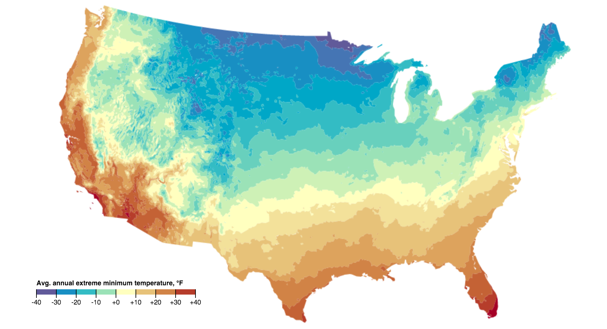

Open Plant Hardiness Zones (OPHZ)
===

OPHZ is free and open raster and vector data derived from the public domain map images available at http://planthardiness.ars.usda.gov/

In the [original public domain PDF map](http://planthardiness.ars.usda.gov/PHZMWeb/Images/All_states_halfzones_poster_rgb_300dpi.pdf) (305MB!), there are some gaps due to rivers, borders, and coastlines.  OPHZ fills most of these gaps with the nearest values.

OPHZ currently covers the 48 contiguous US states (US48), and is available in the following formats:
* **shp** - national polygon shapefile
* **geojson** - polygon geojson files (one for each state)
* **topojson** - national topojson file
* **tif** - GeoTiff raster, two versions:
  * ophz-us48.tif - Each colored pixel of the original map image has been translated to a value representing lower end of the corresponding zone's temperature range.  Most gaps have been filled with the nearest data value.
  * ophz-alpha-us48.tif - For those who want the original, unfilled raster with no interpolation of nodata values.  International borders, coastlines, and a few major rivers appear as -98.  Open water is -99.

All vector formats are in WGS84 (EPSG:4326), and the raster formats are in the original Albers projection (EPSG:5070).

[Download latest version](https://github.com/kgjenkins/ophz/releases/latest)

